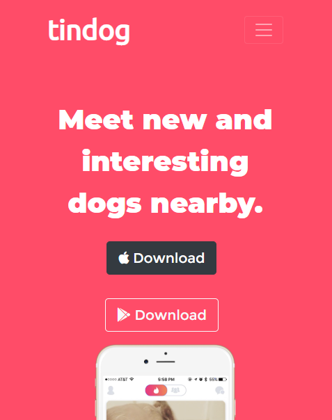

<h1 align="center"> TinDog</h1>
<h4 align="center"> A fully responsive Web page of a sample product using HTML, Bootstrap and advance CSS.</h4>
This is a sample starup app site. Anyone who wants to launch an app can use a site like this.

Here is the screenshot of the <b>Title</b> section of my sample website : -

<h3 align="center"><a href="https://musfiqdehan.github.io/StartUp-App-Site/">Click here to view the full site<a/></h3>
  
## Desktop view:

  

## Mobile View:

